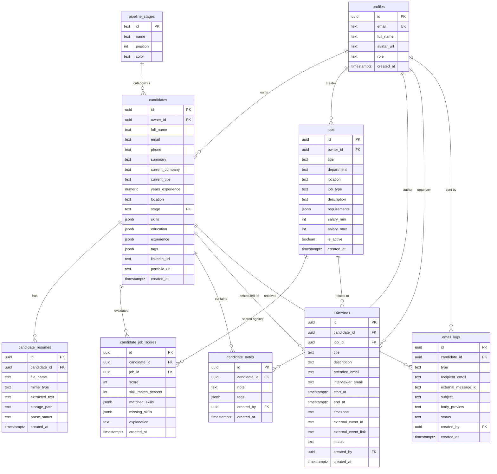

# AI Recruitment CRM — Comprehensive System Documentation

Welcome to the end-to-end system documentation for the **AI Recruitment CRM**. This application is an advanced, modern Applicant Tracking System (ATS) and customer relationship manager powered by Google Gemini AI, designed to automate resume parsing, candidate scoring, automated email outreach, and interview scheduling.

---

## 1. System Architecture & End-to-End Flow

The system is built on a decoupled yet highly integrated architecture, using a Next.js (App Router) frontend, a modular Express backend, and a Supabase (PostgreSQL) database.

### Architectural Blueprint

```
                     ┌──────────────────────────────────────────────┐
                     │             Browser (React / Next.js)        │
                     │  ┌──────────────┐ ┌──────────┐ ┌──────────┐  │
                     │  │ Candidates   │ │ Jobs     │ │ Analytics│  │
                     │  │ Kanban Board │ │ Manager  │ │ Dash     │  │
                     │  └──────────────┘ └──────────┘ └──────────┘  │
                     └──────────────────────┬───────────────────────┘
                                            │
                                            │ HTTP REST (fetch / React Query)
                                            ▼
                     ┌──────────────────────────────────────────────┐
                     │          Next.js API Catch-All Route         │
                     │            pages/api/[[...path]].js          │
                     └──────────────────────┬───────────────────────┘
                                            │ Direct Function Call
                                            ▼
                     ┌──────────────────────────────────────────────┐
                     │           Express Application (Server)       │
                     │  ┌────────────────────────────────────────┐  │
                     │  │ Routes (candidates, jobs, matching,    │  │
                     │  │         interviews, emails, analytics) │  │
                     │  └────────────────────────────────────────┘  │
                     └──────┬───────────────────┬───────────────┬───┘
                            │                   │               │
                            ▼                   ▼               ▼
                     ┌──────────────┐    ┌──────────────┐┌──────────────┐
                     │   Supabase   │    │ Google Gemini││External APIs │
                     │  PostgreSQL  │    │  Flash API   ││(Resend Email,│
                     │  + Auth      │    │(Resume Parse ││Google Cal)   │
                     │  + Storage   │    │  & Scoring)  ││              │
                     └──────────────┘    └──────────────┘└──────────────┘q
```

### Server Execution Modes
To maximize architectural flexibility, the system supports two API routing options:
1. **Integrated Serverless Mode (Default):** Express is embedded directly into Next.js using a wildcard Pages Router API catch-all ([[[...path]].js](file:///C:/Users/andro/Ai-Recruitment-CRM/src/pages/api/[[...path]].js)). Requests to `/api/*` are handled by serverless Express middleware functions.
2. **Standalone Server Mode:** Express runs as a dedicated Node.js service (configured on port `4000`) for high-throughput scaling or traditional VM deployments. The frontend routes traffic by setting the `NEXT_PUBLIC_API_URL` environment variable.

### Core End-to-End Workflow
1. **Ingestion:** Recruiter uploads a candidate resume (PDF, DOCX, TXT) via the Kanban board.
2. **Parsing:** The Express backend receives the file, extracts plain text using Apache Tika or local fallbacks (`pdf-parse`, `mammoth`), and passes it to the Google Gemini AI Model.
3. **Structured Storage:** Gemini structures the resume into JSON format (containing name, skills, experience, education). The database writes these details to the `candidates` and `candidate_resumes` tables, and stores the raw file in Supabase Storage.
4. **Job Matching & AI Scoring:** The recruiter initiates a score matching request against a job description. Gemini calculates a 0-100 score, lists missing/matched skills, and explains the rating.
5. **Pipeline Progression:** Recruiter drags the candidate to the "Shortlisted" or "Interview" stage.
6. **Outreach & Scheduling:** The recruiter emails the candidate (via Resend) or schedules a calendar event synced with Google Calendar.

---

## 2. Authentication & Authorization Flow

The system uses a JWT-based authentication system managed by Supabase Auth, combined with custom middleware controls on the Express backend.

```
┌───────────┐           Credential Sign-in           ┌───────────────┐
│           ├───────────────────────────────────────>│               │
│           │                                        │   Supabase    │
│           │<───────────────────────────────────────┤   Auth API    │
│  Browser  │            JWT Access Token            │               │
│           │                                        └───────────────┘
│           │           API request with JWT
│           ├───────────────────────────────────────┐
└───────────┘                                       │
      ▲                                             ▼
      │                                      ┌───────────────┐
      │       Authorized JSON Response       │  Express API  │
      └──────────────────────────────────────┤  Middleware   │
                                             │ (requireAuth) │
                                             └───────────────┘
```

### Sign-Up and Profile Synchronization
1. When a user registers via `/login` (Sign Up mode), the client triggers `supabase.auth.signUp()`.
2. A trigger inside the database (`on_auth_user_created`) intercepts the transaction and automatically copies the newly registered user's metadata into the `profiles` table.

### Middleware Enforcements
On the Express API server, endpoints are protected using two primary middleware guards found in [auth.js](file:///C:/Users/andro/Ai-Recruitment-CRM/server/middleware/auth.js):
* **`requireAuth`**: Reads the `Authorization: Bearer <JWT_Token>` request header, verifies the token with Supabase Admin (`supabaseAdmin.auth.getUser(token)`), and populates `req.user` and `req.profile`.
* **`requireRole(role)`**: Validates that `req.profile.role` matches the route's authorization criteria (e.g., `'admin'`). If it does not match, it terminates the request with a `403 Forbidden` status.

### Demo Mode Bypasses
If Supabase is not configured (e.g. environment variables are missing):
* The frontend bypasses real auth when signing in with the username `demo@recruitcrm.local`.
* `requireAuth` injects a stub user: `{ id: 'demo-user', email: 'demo@recruitcrm.local', role: 'recruiter' }`.

---

## 3. Database Schema & Relationships

The database is built on PostgreSQL with Row-Level Security (RLS) policies configured for multi-tenant isolation. Below is the relational entity model.



### Table Details
1. **`profiles`**: Stores recruiter credentials and roles. Has check constraint `role in ('admin', 'recruiter')`.
2. **`pipeline_stages`**: Lookup table seeding stages: `New`, `Parsed`, `Shortlisted`, `Interview Scheduled`, `Selected`, `Rejected`.
3. **`candidates`**: Tracks candidate profiles, contact info, stages, and structured resume information.
4. **`candidate_resumes`**: Retains text extractions and storage links to uploaded physical files.
5. **`jobs`**: Job postings that candidates are matched against.
6. **`candidate_job_scores`**: Holds scores from Gemini AI evaluations (0-100 scale).

---

## 4. Feature & Integration Modules

### A. Resume Parser (Apache Tika & AI Extraction)
* **Text Extraction**: The system uploads files to a private Supabase Storage bucket. The file contents are processed using [tika.js](file:///C:/Users/andro/Ai-Recruitment-CRM/server/lib/tika.js). If Apache Tika is not configured, the server falls back to `pdf-parse` (for PDF documents) or `mammoth` (for DOCX files).
* **Gemini Parsing**: Extracted plain text is passed to Google Gemini with instructions to output structured JSON representing the candidate's core profile.

### B. AI Ranking & Vector Matching
* **Semantic Vector Search**: Uses the [faiss.js](file:///C:/Users/andro/Ai-Recruitment-CRM/server/lib/faiss.js) helper to compare candidate skills with job description requirements to determine keyword similarity.
* **Gemini Assessment**: Gemini evaluates candidate experience against job requirements, outputs an aggregate score, and generates a structured explanation of strengths and weaknesses.

### C. Automated Email Ingestion (Resend API)
* Built-in templates in [emails.js](file:///C:/Users/andro/Ai-Recruitment-CRM/server/routes/emails.js) dynamically draft emails using placeholders (e.g., `{{candidate_name}}`).
* Uses **Resend** to send emails. When a candidate's stage updates, recruiters can trigger updates directly to the candidate.

### D. Interview Calendar Sync (Google Calendar API)
* Uses OAuth 2.0 credentials and Google APIs to dynamically schedule video calls.
* Automatically registers events on the recruiter's primary calendar and returns join links directly to the app dashboard.

---

## 5. API Reference

All requests must include the header `Authorization: Bearer <JWT_Token>` when authentication is configured.

| Route | Method | Description | Payload Example |
| :--- | :--- | :--- | :--- |
| `/api/me` | `GET` | Get logged-in user profile details | — |
| `/api/me/users` | `GET` | List all users (Admin only) | — |
| `/api/me/users/:id/role`| `PATCH` | Update a user's role (Admin only) | `{"role": "admin"}` |
| `/api/jobs` | `GET` | List all jobs | — |
| `/api/jobs` | `POST` | Create a new job description | `{"title": "DevOps", "description": "..."}` |
| `/api/candidates` | `GET` | Get all candidates | — |
| `/api/candidates/:id` | `GET` | Get detailed candidate profile | — |
| `/api/candidates/upload`| `POST` | Upload and parse resume | `Multipart/Form-Data` file field `resume` |
| `/api/candidates/:id/stage`|`PATCH`| Update candidate pipeline stage | `{"stage": "shortlisted"}` |
| `/api/candidates/:id/notes`|`POST`| Save recruiter feedback note | `{"note": "Excellent technical interview"}` |
| `/api/matching/score` | `POST` | Calculate matching score | `{"candidateId": "...", "jobId": "..."}` |
| `/api/interviews/schedule`|`POST`| Schedule calendar event | `{"candidateId": "...", "start": "...", "end": "..."}` |
| `/api/emails/send` | `POST` | Email candidate | `{"candidateId": "...", "type": "shortlisted", "to": "..."}` |
| `/api/analytics/summary`| `GET` | Generate dashboard summary data | — |

---

## 6. Installation & Environment Configuration

### Local Setup Instructions
1. Install dependencies:
   ```bash
   npm install
   ```
2. Set up environment variables. Copy `.env.example` to `.env` and fill in the values:
   ```bash
   cp .env.example .env
   ```
3. Run in development mode:
   ```bash
   npm run dev
   ```
   The app will run on [http://localhost:3000](http://localhost:3000) using in-memory demo data.

### Deploying to Production (Vercel)
Deploy to Vercel with a single command:
```bash
vercel --prod
```
Make sure to add all environment variables in your Vercel Dashboard under **Settings → Environment Variables**.
